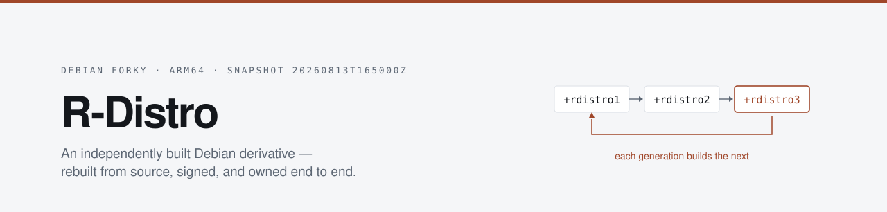

<p align="center">
  <picture>
    <source media="(prefers-color-scheme: dark)" srcset="docs/assets/banner-dark.svg">
    
  </picture>
</p>

<p align="center">
  <a href="https://rshrj.github.io/r-distro/"></a>
  
  
  
  <a href="LICENSE"></a>
  
</p>

<p align="center">
  <b><a href="https://rshrj.github.io/r-distro/">Documentation</a></b> &nbsp;·&nbsp;
  <a href="https://rshrj.github.io/r-distro/#roadmap">Roadmap</a> &nbsp;·&nbsp;
  <a href="https://rshrj.github.io/r-distro/provenance.html">Artifact provenance</a> &nbsp;·&nbsp;
  <a href="docs/native-package-walkthrough.md">Native packages</a>
</p>

---

Most Linux distributions are things you consume. **R-Distro is an attempt to build one you
own** — where depending on Debian is a choice rather than a necessity.

The tooling here pins Debian to an exact snapshot, rebuilds its ARM64 base from source, and
publishes each pass as an immutable signed archive that the next pass builds against. The
destination is a rolling system that tracks Debian testing continuously, carries local
patches across each advance, and composes the result into images for a fleet.

1. **Own the tooling.** Be able to rebuild Debian's base yourself, and know exactly which
   packages you still cannot. That measurement is the [self-hosting boundary](#the-self-hosting-boundary).
2. **Inject your own code.** A defined point in the pipeline where local patches — or your
   own versions of a source package entirely — enter the build and travel with it across
   every subsequent update.
3. **Ship a distribution.** Compose Debian, that tooling, and the custom code into
   installable artifacts for a managed fleet of machines.

> **The pinned snapshot is a stage, not the design.** Advancing the pin — safely,
> repeatedly, carrying your patches with it — is the actual product. Everything currently
> here is scaffolding for that.

## Background

The idea comes from **gLinux**, Google's in-house Linux distribution for workstations. Its
current incarnation, **Rodete** — "Rolling Debian Testing" — replaced an Ubuntu LTS-based
predecessor, and the argument for it, laid out in public DebConf talks, was that
*continuous small migrations beat big-bang ones*. Rather than a painful distribution
upgrade every two years, gLinux tracks Debian testing and moves forward in small, tested
increments.

The machinery behind it continuously ingests Debian, rebuilds it, rebases local patches on
top, gates on tests, and advances the tracked snapshot only when the result is good.
R-Distro is that idea rebuilt from scratch at a scale one person can operate.

The differences are honest ones. Google rebuilds the whole archive because Google has the
compute. R-Distro computes the *minimum* set that must be rebuilt for the claim to mean
anything, and lets everything else fall through to Debian unchanged — a hybrid archive that
works because `+rdistroN` sorts above Debian's own versions while preserving upstream
ordering.

## Frozen inputs

Everything derives from three pinned things. Nothing resolves "latest".

| Input | Value |
|---|---|
| Debian snapshot | `20260813T165000Z` |
| Bootstrap image | `debian@sha256:8fe7e20e…350d276` |
| Base source set | the 49 packages in [`manifests/base-sources.txt`](manifests/base-sources.txt) |

All three container images disable `Check-Valid-Until`, so the pinned snapshot keeps
resolving indefinitely rather than expiring out from under a multi-day campaign.

## Generations

A generation is a complete rebuild of a package set. Generation *N* stamps every package it
produces with a `+rdistroN` version suffix — high enough to win against Debian's version,
low enough to preserve upstream ordering — and is promoted as an immutable signed release
before the next generation starts.

| | Built against | Version suffix |
|---|---|---|
| **Gen 1** | Debian snapshot binaries | `+rdistro1` |
| **Gen 2** | R-Distro binaries preferred | `+rdistro2` |
| **Gen 3** | controller-driven rebuild of the boundary | `+rdistro3` |
| **Gen 4** | *the proof* — Gen 3 rebuilt using only Gen 3 | `+rdistro4` |

Self-hosting is claimed only where a generation can be rebuilt entirely from the previous
generation's own binaries.

## The self-hosting boundary

[`scripts/analyze-selfhost-boundary.py`](scripts/analyze-selfhost-boundary.py) computes
which packages must be buildable for the ARM64 base to be self-hosting. From the 49 base
sources it expands `required` / `important` / `essential` / `build-essential` binaries plus
`Build-Depends`, `Build-Depends-Arch`, `Pre-Depends` and `Depends`, under the
`nocheck nodoc` profiles, and recurses until a full round discovers nothing new.

It is a **fixed point**, not a truncated walk — the same snapshot always yields the same
answer. `Build-Depends-Indep`, `Recommends`, `Suggests`, other architectures and Debian's
cross-toolchain packages are excluded deliberately: none are needed to rebuild the ARM64
base.

| Sources | Binaries | Rounds | Unresolved | Status |
|--:|--:|--:|--:|:--|
| 4725 | 7570 | 14 | 0 | **VALID** |

Full result: [`manifests/selfhost-boundary-arm64.md`](manifests/selfhost-boundary-arm64.md)

## Roadmap

Half the loop exists. The [documentation site](https://rshrj.github.io/r-distro/#roadmap)
carries the detail and the evidence for each claim.

**Shipped** — pinned reproducible build environment · source rebuild with generational
versioning · package build policy as data · signed APT archive · dependency closure
analysis from both observed *and* declared metadata · deterministic self-hosting boundary ·
durable campaign controller with immutable attempts and failure classification · validated
immutable release promotion · per-build provenance measurement · **distribution identity**
(dpkg vendor, archive keyring, minimal metapackage) · **a source workspace** for authoring
local patches and native packages.

**Next** — the gap between a pinned rebuild and a rolling distribution:

- **Parameterise the pin.** The snapshot is hardcoded in all three Dockerfiles and the date
  is baked into image tags across seven tracked files, while
  `manifests/2026-08-13/bootstrap-snapshot.txt` declares it as data that nothing reads.
- **Snapshot diff → changed-source manifest.** The missing primitive, and the cheapest —
  `Sources` index parsing, not compute. Feeds the existing `rdistroctl plan --manifest`
  unchanged.
- **Wire overrides into the build.** Patches can now be authored and saved to
  `overrides/<source>/patches/`, but **nothing in the campaign path reads them** — a
  campaign build still rebuilds the unmodified Debian source and reports nothing unusual.
  `build-package.sh` already has the `PRE_BUILD_COMMAND` hook to apply them at.
- **Patch rebase detection.** Notice when a local patch stops applying or lands upstream,
  and drop it. This is what makes it a system rather than a pile of diffs.
- **Build the image.** The simple-cdd configuration and the pinned debian-installer
  manifest are in `image/`; no ISO has been produced from them yet.

**Planned** — test gating (`autopkgtest` and `sbuild` ship in the controller image but are
not yet invoked) · explicit hybrid-archive policy.

## Status

- **`gen3-canary`** — promoted. The 41-package canary in
  [`manifests/selfhost-canary-arm64.txt`](manifests/selfhost-canary-arm64.txt) rebuilt
  clean: 1061 signed artifacts, including the full toolchain, the kernel, and the packaging
  tools that build everything else.
- **`gen3-bootstrap`** — in progress across the full 4725-source boundary; 2732 sources
  rebuilt so far, 55 failing, 3066 attempts recorded.

## Quick start

```sh
# Build the images (pinned to the snapshot)
docker build -t rdistro-buildroot:2026-08-13 buildroot/

# Generate an archive signing key
mkdir -p keys/gnupg repo/keys && chmod 700 keys/gnupg
GNUPGHOME=keys/gnupg gpg --gen-key
GNUPGHOME=keys/gnupg gpg --armor --export archive@rdistro.local \
    > repo/keys/rdistro-archive.asc

# Rebuild one package
scripts/build-package.sh hello 1
```

Artifacts land in `work/builds/hello`. Set `USE_RDISTRO=1` to build against a running
R-Distro archive instead of Debian binaries; `RDISTRO_OUTPUT_DIR` overrides the output path.

Packages needing an exception declare it in `config/package-policy/$PKG.env` rather than
being special-cased in the build script:

```sh
# config/package-policy/bash.env  — bash needs its documentation targets
DEB_BUILD_OPTIONS="nocheck"
DEB_BUILD_PROFILES="nocheck"

# config/package-policy/linux.env — the kernel generates its own control file
PRE_BUILD_COMMAND='make -f debian/rules debian/control-real'
```

Fifty-five sources cannot build under `nodoc` at all — their `debian/install` names
documentation the build was told not to generate. They are listed once in
`config/package-policy/nodoc-incompatible.txt` rather than getting a file each.

To carry a local change to a Debian source, or to add a package of your own:

```sh
# Edit a pinned Debian source in a git-backed workspace
scripts/rdistroctl.py source-edit hello      # work/edit/hello, first commit = pristine
scripts/rdistroctl.py source-save hello      # -> overrides/hello/patches/ (quilt series)
scripts/rdistroctl.py source-shell hello     # build it with the patches applied

# Scaffold a native package
scripts/rdistroctl.py package-new my-tool    # -> packages/my-tool/
```

> [!IMPORTANT]
> Overrides are **not yet read by campaign builds**. `rdistroctl run` still rebuilds the
> unmodified pinned source and succeeds without mentioning it. `source-shell` is currently
> the only path that applies them.

### Running a campaign

```sh
scripts/rdistroctl.py doctor --manifest manifests/selfhost-boundary-arm64.txt
scripts/rdistroctl.py plan   --campaign gen3-bootstrap --generation 3 \
                             --manifest manifests/selfhost-boundary-arm64.txt
scripts/rdistroctl.py run    --campaign gen3-bootstrap --parallel 4
scripts/rdistroctl.py status --campaign gen3-bootstrap
```

State lives in SQLite. A campaign survives `pause`, `resume`, and the controller process
dying. Every build is an immutable attempt with its own artifact directory, so a retry never
destroys the evidence from the attempt before it, and failures are classified from their
logs — which is what turns several hundred red jobs into a handful of real problems.

### Publishing a release

```sh
scripts/rdistro_repo.py validate --campaign gen3-bootstrap \
                                 --manifest manifests/selfhost-canary-arm64.txt
scripts/rdistro_repo.py stage    --campaign gen3-bootstrap \
                                 --manifest manifests/selfhost-canary-arm64.txt \
                                 --release gen3-canary
scripts/rdistro_repo.py promote  --release gen3-canary
```

`validate` writes nothing; it checks that every source in the manifest has a successful
attempt carrying exactly one `.dsc` at the version the generation implies. `stage`
hardlinks artifacts, generates APT indices and signs `Release`. `promote` renames staging
into `repo/releases/` on the same filesystem — an atomic rename, so a release is either
absent or complete, never half-published.

## Scale

All of this runs on a single **MacBook Pro M3 Pro**. No build farm, no CI fleet, no object
storage.

That constraint shapes the architecture rather than limiting the ambition. Rebuilding the
entire Debian archive is not available; computing the minimum set that must be rebuilt, and
rebuilding only what changed since the last snapshot, is. Both are better engineering than
brute force — and both were forced by the constraint.

## Documentation

**[rshrj.github.io/r-distro →](https://rshrj.github.io/r-distro/)**

- [**Roadmap**](https://rshrj.github.io/r-distro/#roadmap) — what is built, what is next,
  and the evidence for each claim.
- [**Artifact provenance**](https://rshrj.github.io/r-distro/provenance.html) — every
  generated artifact traced back to the exact command that produces it, plus a from-scratch
  runbook and the twenty artifacts on disk that **no current script can produce any more**.
  Also available as [Markdown](docs/GENERATED-ARTIFACTS.md).
- [**Native package walkthrough**](docs/native-package-walkthrough.md) — the full round
  trip for an R-Distro native package: build, publish to a development archive, install,
  and verify the distribution identity took effect.

## Layout

```
builder/        package-rebuild image, pinned to the snapshot
buildroot/      unprivileged build image; BASE_IMAGE is parameterised so
                later generations build inside an R-Distro base
controller/     orchestration image (sbuild, autopkgtest, docker-cli)

image/          simple-cdd installer image build; the mirror is preseeded to
                the same pinned snapshot, so the ISO inherits the pin

config/package-policy/    per-package build exceptions, as data
                          (.env per package, plus the nodoc exemption list)

packages/       R-Distro's own native packages - release metadata and the
                dpkg vendor, the archive keyring, the minimal metapackage
overrides/      local patches over pinned Debian sources, quilt series
                (created by source-save; not yet read by campaign builds)

manifests/
  2026-08-13/             pinned snapshot and bootstrap image digests
  debian-installer-arm64.txt
                          pinned d-i daily build for the installer image
  base-sources.txt        the 49-source base set (curated)
  bootstrap-frontier-common.txt
                          52 packages at the edge of the closure (curated)
  selfhost-canary-arm64.txt
                          41-package fail-fast slice (curated)
  selfhost-boundary-arm64.md
                          the boundary result

scripts/
  build-package.sh              rebuild one source package
  build-base.sh                 early parallel driver over the base set
  publish.sh / publish-all.sh   signed development archive
  analyze-deps.py               what was actually installed per build
  analyze-bootstrap-closure.py  closure from observed build deps
  analyze-bootstrap-recursive.py
                                closure from declared metadata
  botch-*-safe.py               deb822 normalisation for botch
  filter-botch-universe.py      narrow the universe to R-Distro
  analyze-selfhost-boundary.py  the boundary fixed point
  rdistroctl.py                 campaign controller
  rdistro_repo.py               validate / stage / promote releases
  rdistro_source.py             source workspace: edit, save, build, scaffold
  retry-fetch-failures.py       requeue transient snapshot fetch failures
  buildwatch.py                 terminal progress bar for a running build
  buildactivity.swift           the same, as a macOS menu-bar item
```

## What is not in this repository

Git holds source, configuration, policy, documentation and frozen input definitions. It does
not hold anything the tracked scripts can produce, which is roughly **51 GB** of build
roots, APT pools, analysis dumps and logs.

| Untracked | Regenerate with |
|---|---|
| `work/` — build roots, campaign DB, fetched sources | `rdistroctl.py plan` + `run` |
| `repo/`, `repo-pass*/` — APT pools, indices, releases | `rdistro_repo.py stage` + `promote` |
| `analysis/` — dependency graphs, CSVs, DOT/SVG | the `analyze-*` scripts |
| `manifests/selfhost-boundary-arm64.txt` | `analyze-selfhost-boundary.py` |
| `logs/`, `out/` | any build |
| `keys/gnupg/` — archive signing key | `gpg --gen-key`, then re-sign |

The signing key is deliberately absent. Anyone reproducing this generates their own and
signs their own archive; a release is only as trustworthy as the key that signed it, and
that key should never be this one.

> [!NOTE]
> Not every file on disk is reproducible. Twenty categories of artifact exist that no
> current script produces — earlier script versions wrote them, or a human ran the command
> by hand. They are catalogued in the
> [provenance reference](https://rshrj.github.io/r-distro/provenance.html#stranded) rather
> than quietly implied reproducible.

## License

[MIT](LICENSE) © Rishi Raj

Typefaces: [Inter](https://github.com/rsms/inter) and [Fira Mono](https://github.com/mozilla/Fira), both under the [SIL Open Font License 1.1](docs/assets/fonts/) and bundled with the docs site.
