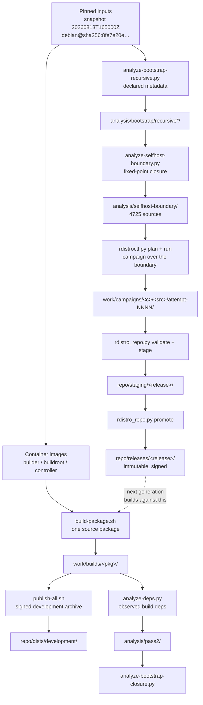
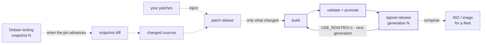

# Generated Artifacts — Provenance Reference

> Part of [R-Distro](https://rshrj.github.io/r-distro/). Also available as a designed,
> browsable page: **<https://rshrj.github.io/r-distro/provenance.html>**

R-Distro rebuilds Debian's ARM64 base from source so that depending on Debian becomes a
choice rather than a necessity. The destination is a rolling system in the spirit of
Google's gLinux — one that tracks Debian testing continuously, carries local patches
across each advance, and composes the result into images for a fleet. What exists today
is the build half of that loop; see the [roadmap](https://rshrj.github.io/r-distro/#roadmap)
for what does not.

That ambition is why this document exists. A system that rebuilds itself repeatedly only
means something if you can say exactly where each artifact came from — and, just as
importantly, which ones you can no longer reproduce.

Every file in this working tree is either **tracked source** or **generated output**.
Git holds only the first kind: source, configuration, policy, documentation, and frozen
input definitions — 36 files, about 470 KB. Everything else, roughly 31 GB, is produced
by running the tracked scripts.

This document walks each generated artifact back to the exact command that produces it,
in the order the pipeline produces them. Where an artifact on disk can **no longer** be
produced by any current script, it is called out explicitly in
[Stranded artifacts](#stranded-artifacts) rather than being quietly implied reproducible.

Read it as the answer to two questions: *what made this file?* and *what happens if I
run that again today?*

---

## How to read this

Every artifact carries one of three provenance markers.

| Marker | Meaning |
|---|---|
| **SCRIPT** | Produced by a tracked script. Re-running regenerates it. |
| **MANUAL** | Produced by a command a human ran directly. Reproducible, but only if you know the command — it is written down here. |
| **STRANDED** | On disk, but no current script produces it. Usually an earlier version of a script wrote it. Re-running today will *not* recreate it. |

Two conventions used throughout:

- **`<gen>`** is the generation number. Generation *N* stamps its packages `+rdistroN`.
- Paths are relative to the repository root.

---

## The pipeline



The loop at the bottom is the point of the project: each generation is promoted to an
immutable signed archive, and the generation after it builds against that archive
instead of against Debian.

### Where this is going

The pipeline above starts from a snapshot someone pinned by hand. The target replaces
that with a loop that advances the pin on its own, rebuilding only what Debian changed
and carrying local patches across each advance. Dotted edges do not exist yet.



Solid edges work today. Everything dotted — snapshot diffing, patch injection, patch
rebase detection, image composition — is described in the
[roadmap](https://rshrj.github.io/r-distro/#roadmap).

---

## Stage 1 — Container images

**MANUAL.** No tracked script builds the images; they are built by hand from the tracked
Dockerfiles.

```sh
docker build -t r-distro-builder:2026-08-13     builder/
docker build -t rdistro-buildroot:2026-08-13    buildroot/
docker build -t rdistro-controller:2026-08-13   controller/
```

| Image | Built from | Used by |
|---|---|---|
| `r-distro-builder:2026-08-13` | `builder/Dockerfile` | `scripts/publish.sh` |
| `rdistro-buildroot:2026-08-13` | `buildroot/Dockerfile` | `scripts/build-package.sh`, `rdistro_repo.py stage` |
| `rdistro-controller:2026-08-13` | `controller/Dockerfile` | `scripts/publish-all.sh` |

The tag `2026-08-13` is hardcoded in all four consumers. `buildroot/Dockerfile` accepts
`--build-arg BASE_IMAGE=…` so a later generation can be built inside an R-Distro base
rather than the Debian one; the other two pin Debian directly.

All three disable `Check-Valid-Until`, so the pinned snapshot keeps resolving
indefinitely rather than expiring partway through a multi-day campaign.

---

## Stage 2 — Signing key

**MANUAL.** Generated once with `gpg --gen-key` into a repository-local GNUPGHOME.

```sh
GNUPGHOME=keys/gnupg gpg --gen-key            # identity: archive@rdistro.local
GNUPGHOME=keys/gnupg gpg --armor --export archive@rdistro.local \
    > repo/keys/rdistro-archive.asc
```

| Artifact | Provenance | Notes |
|---|---|---|
| `keys/gnupg/pubring.kbx`, `trustdb.gpg`, `private-keys-v1.d/`, `openpgp-revocs.d/` | MANUAL | **Private key material. Never committed.** |
| `keys/gnupg/S.gpg-agent*` | MANUAL | Agent sockets; transient, deliberately not copied into containers |
| `repo/keys/rdistro-archive.asc` | MANUAL | Public key export, mounted into every build |

The key in this tree has fingerprint `F0590CEF4051A2E570640F886FE07B0A34055EFB`. Anyone
reproducing R-Distro should generate their own — a release is only as trustworthy as the
key that signed it.

> **The public key is a hard prerequisite for every build.** `build-package.sh` mounts
> `repo/keys/rdistro-archive.asc` unconditionally, even when `USE_RDISTRO=0`. If it is
> missing, Docker fails with an unhelpful mount error before the build starts.

---

## Stage 3 — Building packages

### `scripts/build-package.sh <pkg> [rev]`

Rebuilds one Debian source package inside `rdistro-buildroot:2026-08-13`:
`apt-get source` → `dch` to `+rdistro<rev>` → `mk-build-deps` → `dpkg-buildpackage`.

**Output — SCRIPT:** `work/builds/<pkg>/` (or `$RDISTRO_OUTPUT_DIR`), wiped with
`rm -rf "$OUT"/*` at the start of every run.

| File | Meaning |
|---|---|
| `<src>_<ver>+rdistro<rev>.dsc` | Source control file |
| `<src>_<ver>.orig.tar.*` | Upstream tarball, copied from the `.dsc` file list |
| `<src>_<ver>+rdistro<rev>.debian.tar.*` / `.diff.gz` | Debian packaging delta |
| `<bin>_<ver>+rdistro<rev>_arm64.deb` | Binary packages (one or more) |
| `<bin>-dbgsym_…_arm64.deb` | Debug symbols |
| `<src>_…_arm64.buildinfo` | **Records `Installed-Build-Depends` — the provenance evidence** |
| `<src>_…_arm64.changes` | Upload control file |

Environment:

| Variable | Default | Effect |
|---|---|---|
| `USE_RDISTRO` | `0` | `1` adds the R-Distro archive at `http://host.docker.internal:8080/` and upgrades installed packages to their `+rdistro` versions before building |
| `BUILD_JOBS` | `4` | `dpkg-buildpackage -j` |
| `RDISTRO_OUTPUT_DIR` | `work/builds/<pkg>` | Output path; the controller sets this per attempt |
| `DEB_BUILD_OPTIONS` / `DEB_BUILD_PROFILES` | `nocheck nodoc` | Overridden per package by policy |
| `PRE_BUILD_COMMAND` | *(empty)* | Shell hook run in the source tree before the build |

Package-specific exceptions live in `config/package-policy/<pkg>.env`, sourced
automatically. Two exist today: `bash.env` drops `nodoc` (the bash build needs its
documentation targets), and `linux.env` sets a `PRE_BUILD_COMMAND` that regenerates
`debian/control-real` before `Build-Depends` can be read.

After any `PRE_BUILD_COMMAND` the script sweeps `__pycache__` directories and `*.pyc`
files from the source tree, so a preparation hook cannot contaminate the source package.

### `scripts/build-base.sh [rev]`

Drives `build-package.sh` in parallel across `manifests/base-sources.txt` (49 sources).
Superseded by `rdistroctl.py` for anything larger.

**Output — SCRIPT:**

| Artifact | Meaning |
|---|---|
| `logs/pass<rev>/<pkg>.log` | Full build log, one per manifest entry |
| `logs/pass<rev>/succeeded` | Newline-separated package names |
| `logs/pass<rev>/failed` | Newline-separated package names |

```sh
PARALLEL=2 BUILD_JOBS=4 scripts/build-base.sh 1
```

---

## Stage 4 — The development archive

### `scripts/publish-all.sh`

Rebuilds the whole development pool from `work/builds`, generates APT indices, and signs
`Release`. Requires `rdistro-controller:2026-08-13` and the private key.

It refuses to run if a source directory holds more than one `+rdistro*.dsc`, copies
exactly the files that `.dsc` references, and publishes only locally-versioned binaries —
so a stale artifact from an earlier pass cannot leak into the archive.

**Output — SCRIPT:**

| Artifact | Meaning |
|---|---|
| `repo/pool/main/r/rdistro/*` | **Flat** pool: every `.deb`, `.dsc`, `.orig.tar.*`, `.debian.tar.*` |
| `repo/dists/development/main/binary-arm64/Packages{,.gz}` | Binary index |
| `repo/dists/development/main/source/Sources{,.gz}` | Source index |
| `repo/dists/development/Release` | `Origin`/`Label` `R-Distro`, `Suite`/`Codename` `development` |
| `repo/dists/development/InRelease` | Inline-signed `Release` |
| `repo/dists/development/Release.gpg` | Detached signature |

`$POOL` (`repo/pool/main/r/rdistro`) is `rm -rf`'d and rebuilt on every run. Nothing
else under `repo/` is touched — see [stranded artifact 12](#12-repopoolmainhhello).

### `scripts/publish.sh <pkg>`

Single-package variant using `r-distro-builder:2026-08-13`. Appends to the same pool
without wiping it. Useful during iteration; `publish-all.sh` is the authoritative path.

### Serving the archive

**MANUAL — and required.** `USE_RDISTRO=1` builds fetch from
`http://host.docker.internal:8080/`, but **no tracked script starts that server**:

```sh
cd repo && nohup python3 -m http.server 8080 \
    > ../work/services/repo-server.log 2>&1 &
echo $! > ../work/services/repo-server.pid
```

| Artifact | Provenance |
|---|---|
| `work/services/repo-server.{log,pid}` | MANUAL |
| `work/services/dashboard.{log,pid}` | MANUAL — a nohup'd `rdistroctl.py dashboard` |

This is the single largest reproducibility gap in the project. Every generation-N build
silently depends on this server being up; if it is down, builds fall back to Debian
binaries and still succeed, quietly producing a package with the wrong provenance.

---

## Stage 5 — Dependency analysis

Four scripts write into `analysis/`. All output is regenerable; none of it is committed.

### `scripts/analyze-deps.py`

Reads `work/builds/*/`.buildinfo` and `.dsc` files plus `manifests/base-sources.txt`,
and records what was *actually* installed to satisfy each build versus what was declared.

> **Hardwired to generation 2.** The script globs `*+rdistro2.dsc` and warns for any
> source where exactly one is not found. It cannot analyze a gen-1 or gen-3 build tree
> without editing. The directory name `analysis/pass2/` is load-bearing, not descriptive.

**Output — SCRIPT** (`analysis/pass2/`, 12 files):

| File | Meaning |
|---|---|
| `installed-build-deps.csv` | Every binary installed for every build, from `Installed-Build-Depends` |
| `debian-fallback-ranking.csv` | Which Debian binaries the base still falls back to, by frequency |
| `top-fallback-binaries.txt`, `top-fallback-sources.csv` | The worst offenders, condensed |
| `package-summary.csv` | Per-source rollup |
| `declared-base{,-edges}.csv/.dot/.svg` | Declared `Build-Depends` graph within the base |
| `gen1-to-gen2{,-edges}.csv/.dot/.svg` | Observed generation-crossing edges |
| `dependency-data.json` | Machine-readable dump of the whole analysis |

### `scripts/analyze-bootstrap-closure.py`

Closure from *observed* build dependencies (`analysis/pass2/installed-build-deps.csv`)
plus `manifests/base-sources.txt` and `manifests/bootstrap-frontier-common.txt`. Refuses
to run if those two manifests overlap.

```sh
scripts/analyze-bootstrap-closure.py --refresh          # fetch snapshot metadata
scripts/analyze-bootstrap-closure.py --mode bootstrap --profile nocheck
```

**Output — SCRIPT:** `analysis/bootstrap/reduced/` — `nodes.csv`, `edges.csv`,
`external-sources.csv`, `strongly-connected-components.csv`, `build-levels.csv`,
`unresolved-dependencies.csv`, `dependency-data.json`, `summary.md`, and
`bootstrap-{core,with-external,scc}.{dot,svg}`. `--refresh` populates
`analysis/bootstrap/reduced/cache/{sources,binaries}.raw` + `snapshot-info.txt`.

> **`--mode` does not change the output directory.** `OUT` is hardcoded to `reduced/`
> (`scripts/analyze-bootstrap-closure.py:22`). Both modes overwrite the same path. Use
> `--no-render` to skip Graphviz.

### `scripts/analyze-bootstrap-recursive.py`

Closure from *declared* metadata over the full snapshot universe — the independent
cross-check on the observation-based closure above.

```sh
scripts/analyze-bootstrap-recursive.py --refresh
scripts/analyze-bootstrap-recursive.py --mode bootstrap   # default; profiles nocheck+nodoc
scripts/analyze-bootstrap-recursive.py --mode full        # no profiles
```

**Output — SCRIPT:**

| Mode | Directory |
|---|---|
| `bootstrap` (default) | `analysis/bootstrap/recursive/` |
| `full` | `analysis/bootstrap/recursive-full/` |
| `--refresh` (either) | `analysis/bootstrap/universe-cache/{sources,binaries}.raw`, `snapshot-info.txt` |

Each output directory holds `nodes.csv`, `edges.csv`, `condensation-edges.csv`,
`build-levels.csv`, `discovery-layers.csv`, `strongly-connected-components.csv`,
`unresolved-{dependencies,sources}.csv`, `dependency-data.json`, `summary.md`,
`bootstrap-{closure,scc}.{dot,svg}`, and `discovery-manifests/depth-NN.txt` — one file
per BFS layer, which is what makes the expansion auditable step by step.

`--max-depth N` truncates the walk; `universe-cache/sources.raw` is 62 MB against
`reduced/cache/sources.raw`'s 2 MB, because this script fetches the entire archive
rather than a filtered slice.

### `scripts/filter-botch-universe.py` and the botch wrappers

Narrows the snapshot universe to just the R-Distro closure so `botch` can ingest it.
Reads `analysis/bootstrap/recursive-full/nodes.csv` and `analysis/bootstrap/universe-cache/*.raw`.

**Output — SCRIPT:** `analysis/bootstrap/botch-rdistro/Sources` and `Packages` — **only
these two files.**

`scripts/botch-bin2src-safe.py` and `scripts/botch-src2bin-safe.py` are stdin/stdout
deb822 normalizers that keep botch from choking on malformed or ambiguous stanzas. They
write no files of their own; they are used inside botch pipelines.

---

## Stage 6 — The self-hosting boundary

### `scripts/analyze-selfhost-boundary.py`

The load-bearing analysis. Starting from `manifests/base-sources.txt`, it expands
`required` / `important` / `essential` / `build-essential` binaries together with
`Build-Depends`, `Build-Depends-Arch`, `Pre-Depends` and `Depends`, under the
`nocheck nodoc` profiles, and recurses until a full round discovers nothing new.

It is a fixed point, not a truncated walk — the same snapshot always yields the same
answer. `Build-Depends-Indep`, `Recommends`, `Suggests`, other architectures and
Debian's cross-toolchain packages are excluded deliberately.

```sh
scripts/analyze-selfhost-boundary.py                     # --out defaults to analysis/selfhost-boundary
```

**Output — SCRIPT** (`analysis/selfhost-boundary/`, 16 files):

| File | Meaning |
|---|---|
| `BOUNDARY.md` | The narrative result: definition, inclusion rules, findings |
| `summary.json` | Machine-readable result, including SHA-256 of both `.raw` inputs |
| `boundary-source-names.txt` | **4725 source names — the campaign manifest** |
| `boundary-sources.txt` / `boundary-binaries.txt` | The same, with versions and architectures |
| `sources.csv`, `binaries.csv` | Full metadata for every package considered |
| `build-edges.csv`, `runtime-edges.csv` | The two dependency relations, separately |
| `seeds.csv` | Why each seed entered the closure |
| `source-sccs.csv`, `boundary-scc.{dot,svg}` | Strongly connected components, condensed |
| `ambiguous-virtuals.csv` | Every virtual package with more than one provider |
| `source-version-mismatches.csv` | Binaries whose source version disagrees |
| `unresolved.csv` | Relations that could not be resolved |

For the pinned snapshot the boundary closes after **14 rounds** at **4725 sources** and
**7570 binaries**, with **0 unresolved relations** and **0 source-version mismatches** —
status **VALID**. 187 ambiguous virtual choices are reported rather than silently
resolved. The SCC condensation is rendered; the full 4711-node graph deliberately is not.

### Promoting the result

**MANUAL.** The two files under `manifests/` are hand-copied from the analysis output:

```sh
cp analysis/selfhost-boundary/BOUNDARY.md               manifests/selfhost-boundary-arm64.md
cp analysis/selfhost-boundary/boundary-source-names.txt manifests/selfhost-boundary-arm64.txt
```

Both are byte-identical to their sources (verified). `manifests/selfhost-boundary-arm64.md`
is **tracked** — it is the headline finding. `manifests/selfhost-boundary-arm64.txt` is
**not** tracked, but the `gen3-bootstrap` campaign points at it as its manifest, so it
must be regenerated before a campaign can be re-planned.

`manifests/selfhost-canary-arm64.txt` is **curated by hand**, not derived — 41 sources
chosen to fail fast. It is a strict subset of the boundary (verified with `comm`).

---

## Stage 7 — Campaigns

### `scripts/rdistroctl.py`

State lives in SQLite at `work/control/rdistro.db`. A campaign survives `pause`,
`resume`, and the controller process dying.

```sh
scripts/rdistroctl.py doctor --manifest manifests/selfhost-boundary-arm64.txt
scripts/rdistroctl.py plan   --campaign gen3-bootstrap --generation 3 \
                             --manifest manifests/selfhost-boundary-arm64.txt
scripts/rdistroctl.py run    --campaign gen3-bootstrap --parallel 4 --build-jobs 4
scripts/rdistroctl.py status --campaign gen3-bootstrap
scripts/rdistroctl.py pause  --campaign gen3-bootstrap
scripts/rdistroctl.py resume --campaign gen3-bootstrap
scripts/rdistroctl.py retry-failed --campaign gen3-bootstrap
scripts/rdistroctl.py dashboard    --campaign gen3-bootstrap   # 127.0.0.1:8765
```

`doctor` checks exactly three things: `build-package.sh` exists **and contains the string
`RDISTRO_OUTPUT_DIR`**, `docker` is on `PATH`, and the manifest exists. It then prints the
build script's SHA-256, the git commit, and the manifest source count. It does not check
images, disk space, or the archive server.

**Output — SCRIPT:**

| Artifact | Written by | Meaning |
|---|---|---|
| `work/control/rdistro.db` | `plan`, `run`, `retry-failed` | Tables `campaigns`, `jobs`, `attempts`, `releases` |
| `work/control/rdistro.db-wal`, `-shm` | SQLite | WAL journal; present while the DB is open |
| `work/campaigns/<c>/controller.json` | `run` | `{parallel, build_jobs, db, only_manifest, updated_at}` |
| `work/campaigns/<c>/controller.log` | `run` | Detached controller stdout |
| `work/campaigns/<c>/controller.pid` | `run` | PID of the detached `_controller` |
| `work/campaigns/<c>/<src>/attempt-NNNN/build.log` | worker | Full build log for that attempt |
| `work/campaigns/<c>/<src>/attempt-NNNN/result.json` | worker | Status, timing, provenance, environment |
| `work/campaigns/<c>/<src>/attempt-NNNN/artifacts/` | worker | `RDISTRO_OUTPUT_DIR` for that attempt |

Attempts are **immutable and numbered**: a retry writes `attempt-0002` beside
`attempt-0001` rather than overwriting it, so the evidence from a failure survives the
fix. This is what `RDISTRO_OUTPUT_DIR` exists for.

#### Job state machine

```
plan  ──INSERT OR IGNORE──▶  PENDING
                               │  worker claims:
                               │  status IN ('PENDING','RETRY')
                               │  ORDER BY attempts ASC, source ASC LIMIT 1
                               ▼
                            BUILDING ──exit 0──▶ SUCCEEDED
                               │  │
                               │  └──exit≠0──▶ FAILED ──retry-failed──▶ RETRY
                               │                                          │
                               └──controller restart───────────────────▶ RETRY
```

`plan` uses `INSERT OR IGNORE`, so re-planning the same campaign is additive and never
resets progress. Re-planning with a *different* generation is refused outright.

On startup the controller sweeps any stale `BUILDING` rows to `RETRY` with
`last_error = 'controller restarted while job was BUILDING'`. Claiming is transactional
and checks the campaign is still `RUNNING`, so `pause` takes effect between jobs.

#### Failure classification

Failures are classified from the **last 300 KB** of the build log, first pattern wins:

| Category | Triggered by |
|---|---|
| `disk` | `no space left on device` |
| `oom` | `out of memory`, `cannot allocate memory`, `oom-kill` |
| `dependency` | `unmet dependencies`, `not installable`, `mk-build-deps: unable`, … |
| `source-fetch` | `failed to fetch`, `unable to find a source package`, … |
| `tests` | `dh_auto_test`, `tests failed`, `failures!!!`, … |
| `configure` | `configure: error:`, `cmake error`, `meson.build:` |
| `docker` | `cannot connect to the docker daemon`, `error response from daemon`, … |
| `compile` | fallback: log contains `error:`, or `make` and `***` |
| `unknown` | fallback: nothing matched, or the log could not be read |

`scripts/retry-fetch-failures.py` is the narrow companion: it re-queues only jobs whose
logs show transient network failures against `snapshot.debian.org`, leaving genuine build
errors alone. It writes nothing but the database. Note that it hardcodes
`DB = "work/control/rdistro.db"` and `CAMPAIGN = "gen3-bootstrap"` — edit before reuse.

---

## Stage 8 — Releases

### `scripts/rdistro_repo.py`

Three phases, each refusing to proceed on bad input.

```sh
scripts/rdistro_repo.py validate --campaign gen3-bootstrap \
                                 --manifest manifests/selfhost-canary-arm64.txt
scripts/rdistro_repo.py stage    --campaign gen3-bootstrap \
                                 --manifest manifests/selfhost-canary-arm64.txt \
                                 --release gen3-canary
scripts/rdistro_repo.py promote  --release gen3-canary
```

**`validate`** writes nothing. For every source in the manifest it requires a job that is
`SUCCEEDED`, a recorded successful attempt, an existing artifact directory, and exactly
one `.dsc` at the `+rdistro<generation>` version the campaign implies.

**`stage` — SCRIPT:** builds into `repo/staging/.<release>.tmp-<pid>`, then moves it to
`repo/staging/<release>/`. Artifacts are hardlinked (falling back to copy across
filesystems); a name collision is a hard error.

| Artifact | Meaning |
|---|---|
| `repo/staging/<release>/pool/main/r/rdistro/<source>/*` | **Per-source** pool subdirectories |
| `repo/staging/<release>/dists/<suite>/main/binary-arm64/Packages{,.gz}` | `apt-ftparchive packages` + `gzip -n -9` |
| `repo/staging/<release>/dists/<suite>/main/source/Sources{,.gz}` | `apt-ftparchive sources` |
| `repo/staging/<release>/dists/<suite>/Release` | `Origin`/`Label` `R-Distro`, `Suite`/`Codename` = release name |
| `repo/staging/<release>/dists/<suite>/InRelease` | `gpg --clearsign` |
| `repo/staging/<release>/dists/<suite>/Release.gpg` | `gpg --armor --detach-sign` |
| `repo/staging/<release>/keys/rdistro-archive.asc` | Public key, copied in |
| `repo/staging/<release>/rdistro-release.json` | Release marker, `status: STAGED` |

`--suite` defaults to the release name. Metadata generation and signing both happen
**inside `rdistro-buildroot:2026-08-13`**, not on the host. The signing step copies only
persistent key material — `pubring.kbx`, `private-keys-v1.d/`, and optionally
`trustdb.gpg` / `gpg.conf` — into `/tmp/gnupg`, deliberately excluding the gpg-agent
sockets from the host GNUPGHOME, chmods everything 700/600, and resolves the key
fingerprint via `gpg --with-colons`.

**`promote` — SCRIPT:** re-checks that `Release`, `Packages`, `Sources` and (when signed)
`InRelease` and `Release.gpg` all exist, rewrites the marker to `status: PROMOTED`, then
`os.rename`s staging into `repo/releases/<release>/`. Same filesystem, so the rename is
atomic — a release is either absent or complete, never half-published. Promoting over an
existing release is refused.

> **Two different pool layouts.** `publish-all.sh` writes a **flat**
> `pool/main/r/rdistro/`; `rdistro_repo.py stage` writes **per-source**
> `pool/main/r/rdistro/<source>/`. Both are valid APT pools and both are found by
> `apt-ftparchive`, but they are not interchangeable — do not point one tool at the
> other's output.

---

## From-scratch runbook

In dependency order. Steps marked **manual** have no script.

```sh
# 1. Images                                                          [manual]
docker build -t r-distro-builder:2026-08-13   builder/
docker build -t rdistro-buildroot:2026-08-13  buildroot/
docker build -t rdistro-controller:2026-08-13 controller/

# 2. Signing key                                                     [manual]
mkdir -p keys/gnupg repo/keys && chmod 700 keys/gnupg
GNUPGHOME=keys/gnupg gpg --gen-key
GNUPGHOME=keys/gnupg gpg --armor --export archive@rdistro.local \
    > repo/keys/rdistro-archive.asc

# 3. Generation 1 — build the base against Debian
PARALLEL=2 BUILD_JOBS=4 scripts/build-base.sh 1
scripts/publish-all.sh

# 4. Serve the archive                                               [manual]
mkdir -p work/services
(cd repo && nohup python3 -m http.server 8080 \
    > ../work/services/repo-server.log 2>&1 & echo $! > ../work/services/repo-server.pid)

# 5. Generation 2 — build against generation 1
USE_RDISTRO=1 PARALLEL=2 scripts/build-base.sh 2
scripts/publish-all.sh

# 6. Analysis (requires a gen-2 tree in work/builds — see caveat 7)
scripts/analyze-deps.py
scripts/analyze-bootstrap-closure.py   --refresh
scripts/analyze-bootstrap-recursive.py --refresh --mode bootstrap
scripts/analyze-bootstrap-recursive.py --mode full
scripts/filter-botch-universe.py

# 7. The boundary
scripts/analyze-selfhost-boundary.py
cp analysis/selfhost-boundary/BOUNDARY.md               manifests/selfhost-boundary-arm64.md   # [manual]
cp analysis/selfhost-boundary/boundary-source-names.txt manifests/selfhost-boundary-arm64.txt  # [manual]

# 8. Canary — 41 packages, fails fast
scripts/rdistroctl.py doctor --manifest manifests/selfhost-canary-arm64.txt
scripts/rdistroctl.py plan   --campaign gen3-bootstrap --generation 3 \
                             --manifest manifests/selfhost-boundary-arm64.txt
scripts/rdistroctl.py run    --campaign gen3-bootstrap --parallel 4 \
                             --only-manifest manifests/selfhost-canary-arm64.txt

# 9. Promote the canary
scripts/rdistro_repo.py validate --campaign gen3-bootstrap \
                                 --manifest manifests/selfhost-canary-arm64.txt
scripts/rdistro_repo.py stage    --campaign gen3-bootstrap \
                                 --manifest manifests/selfhost-canary-arm64.txt \
                                 --release gen3-canary
scripts/rdistro_repo.py promote  --release gen3-canary

# 10. The full boundary campaign
scripts/rdistroctl.py run --campaign gen3-bootstrap --parallel 4
```

---

## Stranded artifacts

Twenty categories of file exist in this tree that **no current script produces**. Each is
listed with what made it, why it is stranded, and what happens if you run the nearest
equivalent today.

### 1. `analysis/bootstrap/full/`

An earlier run of `analyze-bootstrap-closure.py` from when its `OUT` constant pointed at
`full/`. It has its own `full/cache/` and contains `bootstrap-critical.csv`, which **no
current script emits** anywhere. `OUT` is now hardcoded to `reduced/`, and `--mode` does
not change it — so re-running overwrites `reduced/` and never touches `full/`.

### 2. `analysis/bootstrap/recursive-baseline/`

Identical file set to `recursive/`, but **no `--mode` writes to this path**. A baseline
run kept for before/after comparison when build profiles were introduced.

### 3. `analysis/bootstrap/botch/`

`pandas_2.3.3+dfsg-3.{dot,svg}` and `qemu_1:11.0.3+ds-2.{dot,svg}` — per-package build
graphs from manual `botch` invocations while evaluating the tool. No tracked script.

### 4. `analysis/bootstrap/botch-bootstrap/`

`current-Packages`, `current-Sources`, `self-Packages`, `self-Sources`, `target-Sources`,
`iteration.graph.xml` from a manual botch bootstrap iteration. `needed-Packages` and
`needed-Sources` are **0 bytes** — the iteration either found nothing needed or did not
complete.

### 5. `analysis/bootstrap/botch-rdistro/{buildgraph.xml, fvs.txt}`

The *directory* is script-produced, but `filter-botch-universe.py` writes only `Sources`
and `Packages`. These two came from manual `botch-buildgraph` / `botch-fvs` runs.
`fvs.txt` is **0 bytes**.

### 6. `manifests/selfhost-boundary-arm64.{md,txt}`

Byte-identical manual copies of `analysis/selfhost-boundary/BOUNDARY.md` and
`boundary-source-names.txt`. No script performs the copy — see
[Promoting the result](#promoting-the-result). The `.txt` is what the `gen3-bootstrap`
campaign uses as its manifest, so it must be recreated before a campaign is re-planned.

### 7. `analysis/pass2/` cannot be regenerated from a non-gen-2 tree

`analyze-deps.py` globs `*+rdistro2.dsc`. Point it at a gen-1 or gen-3 `work/builds` and
it warns for every source and produces empty results. The generation is hardcoded, not a
parameter.

### 8. `repo-pass1/`, `repo-pass2/`

438 MB each — manual `cp -a repo repo-passN` snapshots taken after generations 1 and 2.
No script references `repo-pass`. They are frozen copies of the development archive at
those two moments and cannot be recreated except by rebuilding those generations.

### 9. `work/builds-pass1/`, `work/builds-pass2/`

56 directories each — manual snapshots of `work/builds` at the same two moments, taken
because `build-package.sh` wipes its output directory on every run.

### 10. `work/src/`

An early host-side `apt-get source hello` workspace, including an unpacked
`hello-2.12.3/` tree. Current builds fetch and unpack source *inside* the container at
`/build/work`; nothing is written here any more.

### 11. `out/hello*.deb`

The earliest ad-hoc build output. Even the pre-policy version of `build-package.sh` wrote
to `work/builds/$PKG`, so this directory predates the script entirely.

### 12. `repo/pool/main/h/hello/`

Standard APT pool layout (`pool/main/<first-letter>/<source>/`) from the earliest publish,
before the pool was consolidated under `pool/main/r/rdistro/`. `publish-all.sh` `rm -rf`s
and rebuilds only `pool/main/r/rdistro`, and scopes `apt-ftparchive` to that same path, so
this directory **survives every republish and is never indexed** — it is dead weight in
the archive tree.

The legacy `publish.sh` is the exception: it runs `apt-ftparchive packages pool/main`,
scanning the whole component. Running it would pull these two `.deb` files into the signed
development index. (The `hello` entries currently in
`repo/dists/development/main/binary-arm64/Packages` are *not* these — their `Filename:`
fields point at `pool/main/r/rdistro/`, from a separate `+rdistro1` build.)

### 13. Stray files directly in `work/builds/`

`hello_2.12.3-1+rdistro2_arm64.{build,buildinfo,changes,deb}`,
`hello-dbgsym_…deb`, and a timestamped
`hello_2.12.3-1+rdistro2_arm64-2026-08-14T08:11:15Z.build` sitting outside any
per-package subdirectory — from an early run where the output directory was `work/builds`
itself. `analyze-deps.py` iterates manifest names, so it ignores them.

### 14. `logs/pass1/*-nonroot.log`, `logs/pass1/tar-serial.log`

`coreutils-nonroot.log`, `ncurses-nonroot.log`, `sed-nonroot.log`, `systemd-nonroot.log`,
`tar-nonroot.log`, `vim-nonroot.log`, `tar-serial.log` — hand-named manual reruns from
when the root/non-root split in the build was being debugged. `coreutils-nonroot.log` is
really a `coreutils` build (its first action is `apt-get source coreutils`); the suffix
is a human annotation. `build-base.sh` only ever writes `<pkg>.log` for names that appear
in `base-sources.txt`.

### 15. `logs/pass2/e2fsprogs-retry.log`

Same pattern — a hand-named single-package retry during pass 2.

### 16. `work/control/rdistro-canary-green.db`, `rdistro-pre-full-gen3.db`

Manual `cp` backups of the controller database taken at two milestones: immediately after
the canary went green, and immediately before the full boundary campaign started. No
script creates or rotates these.

### 17. `work/services/*`

`repo-server.{log,pid}` and `dashboard.{log,pid}`. Both processes are started by hand.
See [Serving the archive](#serving-the-archive) — this is the largest reproducibility gap
in the project, because builds depend on the server without checking for it.

### 18. `keys/gnupg/`

Manual `gpg --gen-key`. `repo/keys/rdistro-archive.asc` is the manual export. The
`.gitignore` excludes both, and `pubring.kbx~` is GnuPG's own backup file.

### 19. `tree.txt`

A 987 KB `tree` dump of the entire working tree, taken by hand on 2026-08-20. A snapshot
of a directory listing, not an input to anything.

### 20. `.DS_Store`

macOS Finder metadata, present at the repository root and in `manifests/`, `repo/`,
`analysis/`, `analysis/bootstrap/`, and `work/campaigns/gen3-bootstrap/`.

---

## Appendix A — Controller database schema

`work/control/rdistro.db`, created by `rdistroctl.py plan`.

**`campaigns`** — one row per campaign. `name` (PK), `generation`, `manifest_path`,
`manifest_sha256`, `created_at`, `git_commit`, `status` (`PLANNED` / `RUNNING` /
`PAUSED`). The manifest hash is what lets you prove later which package set a campaign
actually covered.

**`jobs`** — one row per source per campaign, PK `(campaign, source)`. `status`,
`attempts`, `started_at`, `finished_at`, `duration_sec`, `exit_code`,
`failure_category`, `last_error`, `latest_attempt_dir`, `latest_log`,
`latest_buildinfo`, and the provenance rollup `total_build_deps`, `rdistro_build_deps`,
`debian_build_deps`.

**`attempts`** — append-only, `id` autoincrement. Everything in `jobs` plus `attempt`
number, `attempt_dir`, `log_path`, `buildinfo_path`, `git_commit`,
`build_script_sha256`, and `environment_json`. Nothing here is ever updated in place.

**`releases`** — written by `rdistro_repo.py`. `name` (PK), `campaign`, `generation`,
`suite`, `manifest_path`, `manifest_sha256`, `source_count`, `artifact_count`, `status`,
`staging_path`, `release_path`, `created_at`, `promoted_at`.

## Appendix B — `result.json`

Written per attempt to `work/campaigns/<c>/<src>/attempt-NNNN/result.json`.

```json
{
  "campaign": "gen3-bootstrap",
  "source": "libiberty",
  "attempt": 1,
  "status": "SUCCEEDED",
  "exit_code": 0,
  "duration_sec": 32.77,
  "finished_at": "2026-08-21T11:29:37+02:00",
  "failure_category": null,
  "buildinfo": "…/artifacts/libiberty_20260327-1+rdistro3_arm64.buildinfo",
  "provenance": { "total": 139, "rdistro": 45, "debian": 94 },
  "environment": {
    "started_at": "2026-08-21T11:29:04+02:00",
    "git_commit": "unknown",
    "build_script_sha256": "41d241a9…cab436",
    "generation": 3,
    "use_rdistro": 1,
    "build_jobs": 4,
    "deb_build_options": "nocheck nodoc",
    "deb_build_profiles": "nocheck nodoc",
    "output_dir": "…/artifacts"
  }
}
```

`provenance` is parsed from the `.buildinfo`'s `Installed-Build-Depends` and is the
measurement the whole project exists to produce: of 139 build dependencies, 45 came from
R-Distro and 94 still came from Debian. Self-hosting is the state where `debian` reaches
zero. `build_script_sha256` pins which version of `build-package.sh` produced the result.

## Appendix C — `rdistro-release.json`

Written to the staging root by `stage`, rewritten in place by `promote`.

```json
{
  "release": "gen3-canary",
  "suite": "gen3-canary",
  "campaign": "gen3-bootstrap",
  "generation": 3,
  "manifest": "…/manifests/selfhost-canary-arm64.txt",
  "manifest_sha256": "1f08e89cd0d57256450469f9a98568d328582e88b82efb480e38c47ae1fb5fb8",
  "source_count": 41,
  "artifact_count": 1061,
  "created_at": "2026-08-19T23:23:51+02:00",
  "git_commit": "ffbb3bd45fa8022fe2c29c8aaa3e400577d886c2",
  "signed": true,
  "status": "PROMOTED",
  "promoted_at": "2026-08-19T23:31:45+02:00"
}
```

`git_commit` records the tree that produced the release. Note that the value above
predates the current history — the repository was re-initialised after this release was
promoted, so that hash no longer resolves.

---

## Current state

A point-in-time snapshot, read from `work/control/rdistro.db` on 2026-08-24. These
numbers drift as the campaign advances.

| Release | Status | Sources | Artifacts |
|---|---|---|---|
| `gen3-canary` | PROMOTED, signed | 41 | 1061 |

| Campaign `gen3-bootstrap` (generation 3, 4725 sources) | Count |
|---|---|
| SUCCEEDED | 1910 |
| PENDING | 2552 |
| RETRY | 188 |
| FAILED | 71 |
| BUILDING | 4 |
| Attempts recorded | 2189 |

Of the 71 current failures, 61 are `source-fetch` (transient `snapshot.debian.org`
errors, requeued by `retry-fetch-failures.py`), 7 are `tests`, and 3 are `compile`.

| Directory | Size |
|---|---|
| `work/campaigns/` | 28 G |
| `repo/releases/` | 9.6 G |
| `repo/pool/` | 438 M |
| `repo-pass1/`, `repo-pass2/` | 438 M each |
| `analysis/` | 387 M |
| `logs/` | 170 M |
| Tracked source | ~470 K |
